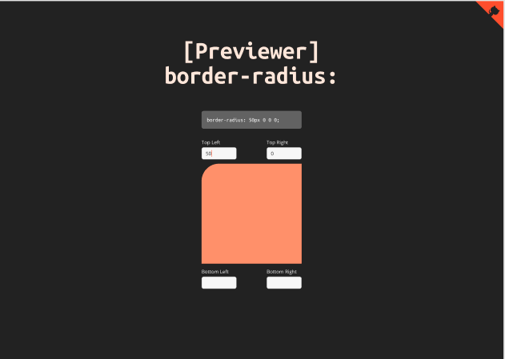

# CSS Preview: Border Radius #DevSoutinhoChallenges

Trata-se do desafio proposto pelo DevSoutinho

construir um previu de border-radiu usando HTML, CSS e JS, ou de preferência ReactJs.

### Image do desafio proposto

---

[#DevSoutinhoChallenges](https://devsoutinho.notion.site/CSS-Preview-Border-Radius-DevSoutinhoChallenges-14fd017db675495b81ce5cd5f68981f0)

### Autor

[Emerson Moreira](https://github.com/eemr3)
